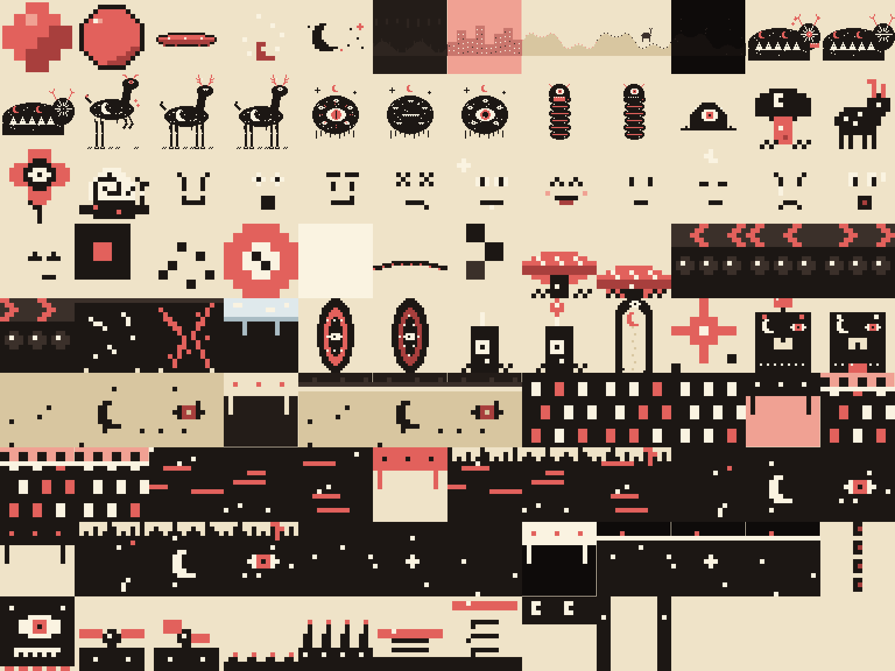

# Шарик

2D-игра на Unity 6 в стиле «мистической гравюры». Пластилиновым шариком управляет **бесплатная нейросеть**: он катится по уровням, думает вслух (облачка и голос), смешно расплющивается в лепёшку и собирается обратно. Постепенно он догадывается, что заперт в матрице и за ним наблюдают. В финале он находит рубильник и выключает мир.

**Вы — наблюдатель.** Включайте ловушки и натравливайте боссов, чтобы мешать шарику.



## Поиграть сразу в браузере

`Web/sharik.html` — браузерный прототип: те же уровни, спрайты, физика, ловушки и боссы, шарик говорит офлайн-фразами. Откройте файл в браузере. Пересборка: `python3 Tools/web/build.py`.

## Что установить на свой компьютер

| Что | Зачем | Где |
|---|---|---|
| **Unity Hub** + **Unity 6 LTS** (6000.x) | Движок | https://unity.com/download |
| **Ollama** | Бесплатная локальная нейросеть — «мозг» шарика | https://ollama.com |
| **Git** (+ Git LFS) | Скачать проект | https://git-scm.com |
| Piper TTS (по желанию) | Настоящий русский голос вместо 8-битного бормотания | https://github.com/rhasspy/piper |
| Aseprite / LibreSprite (по желанию) | Дорисовывать пиксель-арт | aseprite.org / libresprite.github.io |

## Запуск

1. Скачайте проект: `git clone https://github.com/aicartoonsab1-byte/3d-models`.
2. В Unity Hub выберите **Add → Add project from disk** и укажите папку проекта. Если Hub спросит версию, выберите установленную Unity 6.
3. Дождитесь импорта. Если Unity спросит про новый Input System и перезапуск, согласитесь.
4. Нажмите **Play** в любой открытой сцене, даже в пустой Untitled. Игра соберётся сама из кода. Чтобы запускать из собранной игры, сохраните сцену (Ctrl+S) и добавьте её в File → Build Profiles.

## Мозг шарика (нейросеть)

Без нейросети игра тоже работает: шарик говорит заготовленными фразами. Чтобы он думал сам:

```bash
ollama pull qwen2.5:3b      # ~2 ГБ, быстро даже на слабом ПК
# если компьютер мощный — шутки будут лучше:
ollama pull qwen2.5:7b
```

Ollama после установки работает в фоне, больше ничего запускать не нужно. Модель задаётся в `Assets/_Project/Resources/Brain/brain_config.json` (поле `model`).

**Облачный бесплатный API вместо Ollama.** Создайте в корне проекта `brain_config.local.json` (он в `.gitignore`, ключ не утечёт в git):

```json
{ "endpoint": "https://openrouter.ai/api/v1/chat/completions", "model": "<бесплатная модель>", "apiKey": "<ключ>" }
```

Подходит любой OpenAI-совместимый сервер: LM Studio, llama.cpp server, OpenRouter, Groq.

**Настоящий голос (Piper).** Скачайте piper и русскую модель (например, `ru_RU-denis-medium.onnx`) и пропишите в конфиге:
`"voice": "piper", "piperExe": "C:/piper/piper.exe", "piperModel": "C:/piper/ru_RU-denis-medium.onnx"`.

## Управление

| Клавиша | Действие |
|---|---|
| Клик по ловушке или боссу, **1–9** | Включить ловушку (номера висят над ними) |
| **R** | Перезапустить уровень |
| **Esc** | Пауза (в паузе **N / P** — следующий / предыдущий уровень) |
| **F1** | Показать, что шарик «думает»: промпт и ответ нейросети |
| **F2** | Включить / выключить нейросеть |
| **M** | Звук вкл/выкл |

## Устройство проекта

```
Assets/_Project/
  Scripts/        код игры (сцена не нужна)
  Resources/
    Levels/       уровни: ASCII-карта + сценарий (JSON)
    Brain/        характер шарика, офлайн-фразы, настройки нейросети
    Sprites/      пиксель-арт (генерируется)
Design/           дизайн-документ, формат уровней, брифы, превью уровней
Tools/            валидатор уровней, превью, генератор спрайтов, проверка компиляции
.claude/          команда агентов Claude Code для создания уровней
```

- **Дизайн-документ:** [Design/GDD.md](Design/GDD.md)
- **Как устроен уровень:** [Design/LEVEL_FORMAT.md](Design/LEVEL_FORMAT.md)

## Создание уровней командой агентов (Claude Code)

В `.claude/agents/` описана команда:
- **story-writer** — сценарист: реплики, мысли, осколки кода по арке прозрения;
- **level-architect** — строит геометрию уровня;
- **trap-designer** — расставляет ловушки и боссов;
- **playtester** — проверяет проходимость, превью и сюжет.

Скажите Claude «сделай новый уровень про …» или вызовите `/new-level`. Для полной проверки есть `/playtest`.

Инструменты, которые агенты запускают сами:
```bash
python3 Tools/levels/validate.py        # проходим ли уровень (та же физика, что в игре)
python3 Tools/levels/render.py --path   # картинка уровня с путём шарика
python3 Tools/art/generate_sprites.py   # перерисовать спрайты
Tools/compile_check/check.sh            # C# компилируется без Unity
```

Проект подключает официальный плагин Unity для Claude Code (навыки по pixel-perfect, тайлмапам, спрайтам, UI). Claude Code предложит установить его при открытии проекта.
